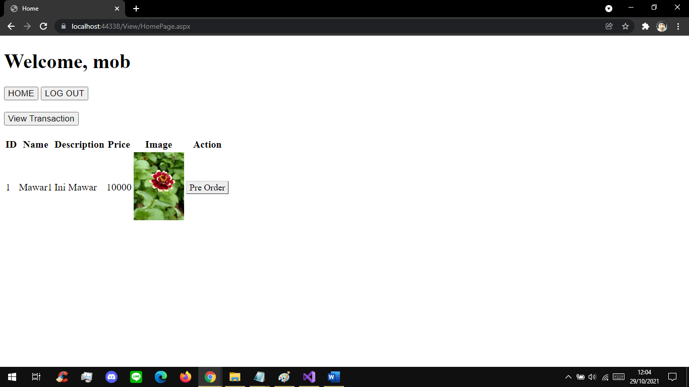
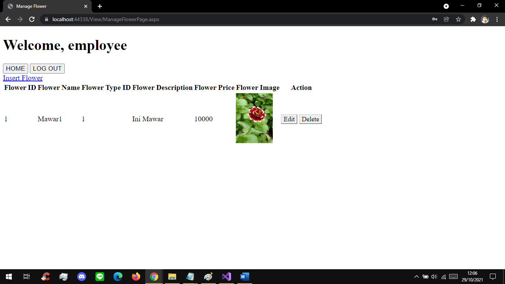
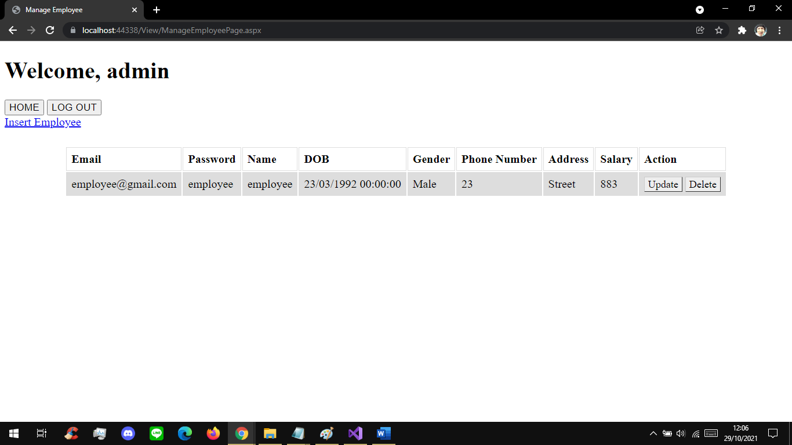

This is a web development project i've done with my team back in March 2021.  
It's a web-app purposely made as a flower shop with online transaction and also transaction report generation.  
It uses ASP.NET framework and follow a DDD software development philosophy.  
Although it lacks some CSS styling, this project mostly teaches me about the mindset of DDD and guide me to follow a standard and appropriate pattern to software development. This mindset ultimately increases coordination between projects member, flexibility and maintainability of the program, and also improve communication between member.  
Languages used: C#, SQL  

Features:  
Login/Register page  
Flower orders for member  
View transaction history for member  
Manage (insert, update, delete) flower listed on the shop by employee  
Manage (insert, update, delete) member and employee registered by admin  
Session and Cookies to save user data  
Page redirects for route handling  

Sneak peek:  

### Member Dashboard  
  

### Employee Dashboard  
  

### Admin Dashboard  
  
