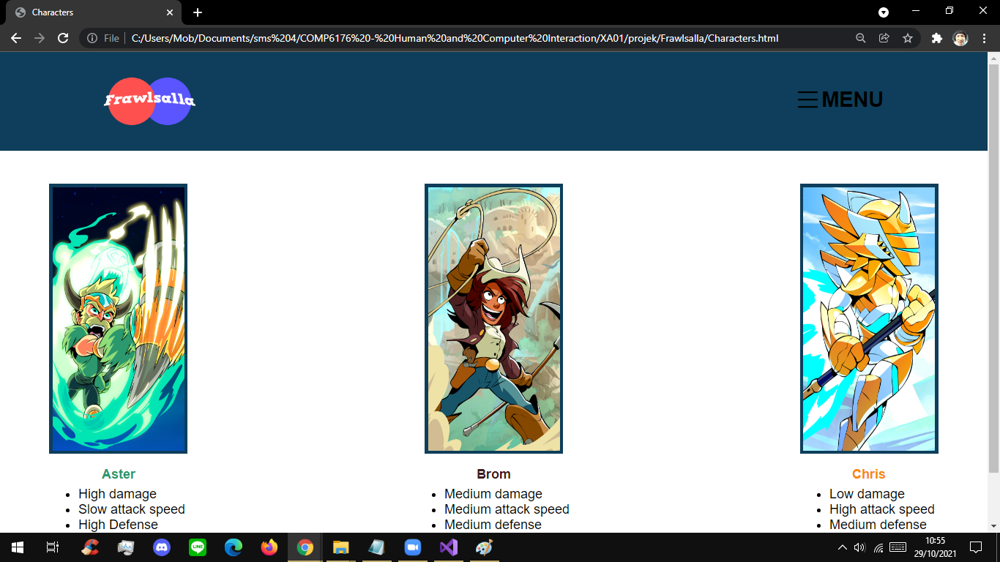
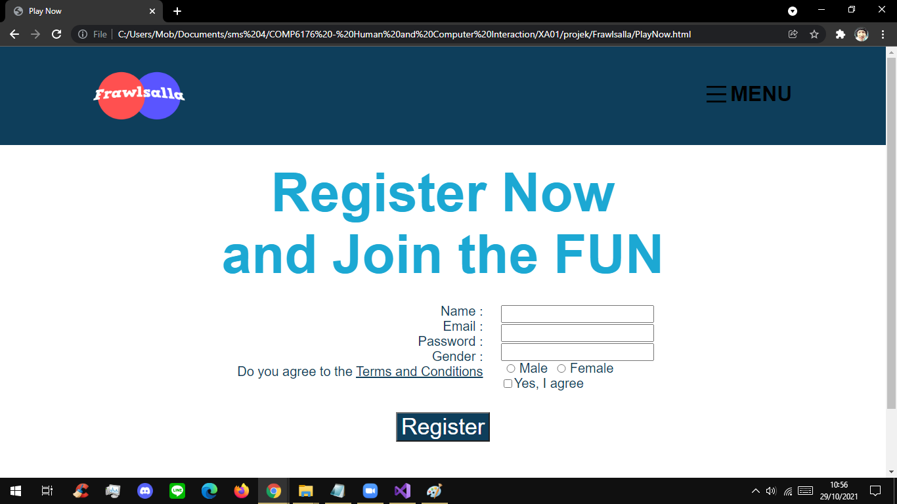

This is a web development project mainly focuses on front-end development.  
Its a simple web for a game called Frawsalla filled with banner, slider and images.  
This project mainly teaches me about following UI design principles and make a user-friendly web pages.  
Languages used: HTML5, CSS, & JS  
Graphic creation/editing: Photoshop  

Features:
Show events with image slider
Show details of the event shown
Show screenshots about the game
Show character and its details
Provide register page

Sneak peek:
### Home Page

### Character Page

### Register Page

